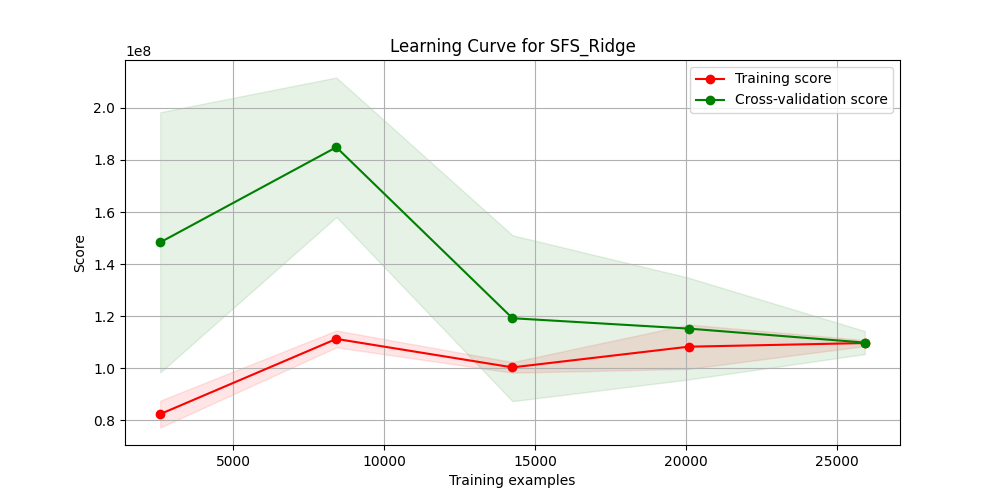
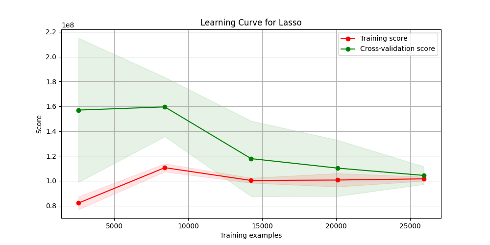
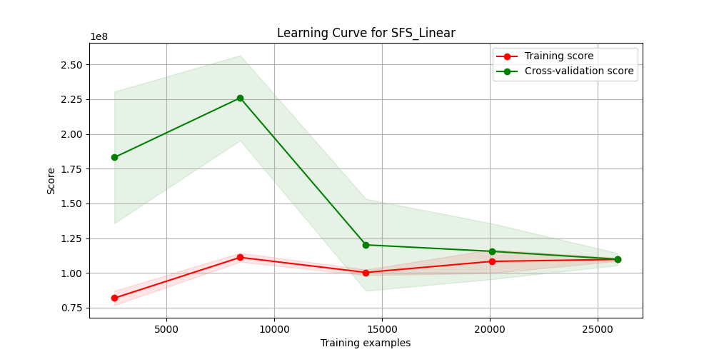
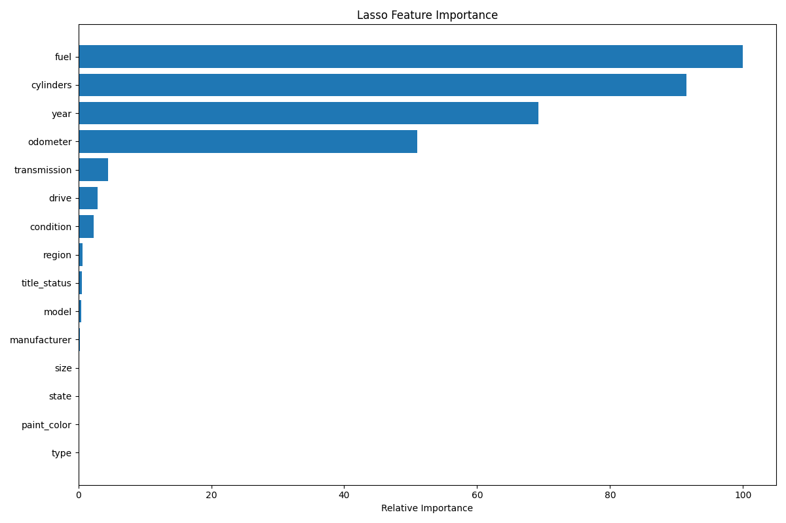
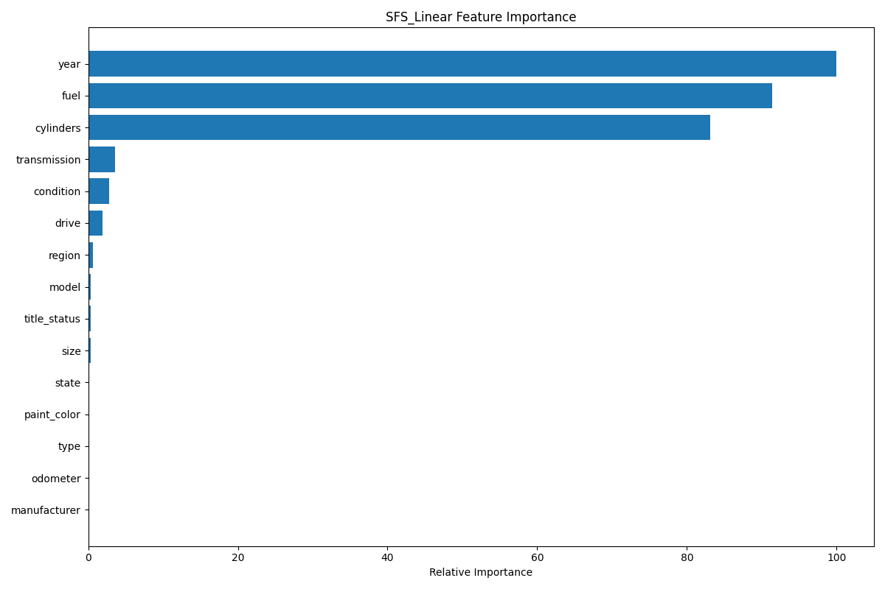

# Introduction
This is an analysis of about 30K car sales in the US. With information on the make, model, mechanical differences and specifications, color, and the region it is in, we want to determine what particular features of the car are stronger predictors for the price. 
## The Business Problem
Our goal is to determine what particular features of the car are stronger predictors for the price. In addition to that, the geographical location of the car may also factor into its sale price depending on the economic conditions of the area. The data received contains information about the make, model, mechanical differences and specifications, color, and the region it is in. The data also contains the price of the car. Our goal is to fit a model that will select the best features to predict the price of the car.
## Preparing the Data
In general, some of the data steps are not necessarily needed such as unique identifiers since those are not features that customers will use to determine price of the car. We removed those columns. Also rows with missing data or nonsensical data like a 0 dollar price on the car were discarded to avoid impacting the data analysis.

# Data Analysis

## Features Used
The following features were used to predict the price of the car:
- region
- year
- manufacturer
- model
- condition
- cylinders
- fuel
- odometer
- title_status
- transmission
- drive
- size
- type
- paint_color
- state

For the categorical features, we used label encoding to convert them to numerical values.

## Model Selection
We performed a grid search on the following models:
- Sequential Feature Selection (both forward and backward) with a Linear Regression model (with simple, 5, and 10-fold cross validation)
- Sequential Feature Selection (both forward and backward) with a Ridge Regression model with multiple alpha values (with simple, 5, and 10-fold cross validation)
- Lasso Regression with multiple alpha values (with simple, 5, and 10-fold cross validation)

## Model Evaluation
The following are the resulting errors of the models:
SFS_Ridge_KFold_5:
- Best parameters: {'ridge__alpha': np.float64(100.0), 'sfs__direction': 'forward', 'sfs__n_features_to_select': 10}
- Best MSE score: 109903169.94511378

SFS_Ridge_KFold_10:
- Best parameters: {'ridge__alpha': np.float64(1000.0), 'sfs__direction': 'forward', 'sfs__n_features_to_select': 10}
- Best MSE score: 111925794.33746584

Lasso_KFold_5:
- Best parameters: {'alpha': np.float64(100.0)}
- Best MSE score: 104289246.0493278

Lasso_KFold_10:
- Best parameters: {'alpha': np.float64(100.0)}
- Best MSE score: 105679575.73858574

SFS_Linear_KFold_5:
- Best parameters: {'sfs__direction': 'forward', 'sfs__n_features_to_select': 10}
- Best MSE score: 109903386.66826352

SFS_Linear_KFold_10:
- Best parameters: {'sfs__direction': 'forward', 'sfs__n_features_to_select': 10}
- Best MSE score: 112124365.12380679

SFS_Ridge_SimpleSplit:
- Best parameters: {'ridge__alpha': np.float64(1000.0), 'sfs__direction': 'forward', 'sfs__n_features_to_select': 10}
- Best MSE score: 116828224.60927722

Lasso_SimpleSplit:
- Best parameters: {'alpha': np.float64(100.0)}
- Best MSE score: 108676196.1484113

SFS_Linear_SimpleSplit:
- Best parameters: {'sfs__direction': 'forward', 'sfs__n_features_to_select': 10}
- Best MSE score: 119051788.2081888

The best model was the Lasso Regression model with a 5-fold cross validation with an alpha value of 100.0. The MSE score was 104289246.0493278.

However, let's look at the learning curves for all the 5-fold cross validation models.

The learning curves show that the Lasso Regression model is the best model as it has the lowest MSE score and the learning curve is the most stable.

Let's look at the feature importance of these models.

While the Sequential Feature Selection with Ridge and Linear Regression had similar ordering in feature importance, mainly year, fuel, and cylinders, the Lasso model had the fuel type as the most important feature.
Looking at one of the sets of co-efficients for the Lasso model:

- region          -297.105813
- year            3756.272295
- manufacturer     141.415012
- model            231.771422
- condition        660.210314
- cylinders       4120.114951
- fuel           -4434.292370
- odometer       -2659.105065
- title_status    -262.675996
- transmission    -877.473997
- drive           -632.051088
- size             155.610929
- type              -0.000000
- paint_color        0.000000
- state             73.688916

We can see that the year is positively correlated. 
The fuel type is negatively correlated which means types like diesel and electric cars are more expensive.
The cylinders are positively correlated which means the more cylinders the car has, the higher the price.
The transmission is negatively correlated which means that automatic transmissions increase the cost more (as the encoding had set automatic as 0 and manual as 1.

# Conclusion
The three most important features for predicting the price of a car are the year, fuel type, and cylinders. The year is positively correlated with the price, while the fuel type and cylinders are negatively correlated. This means that newer cars are more expensive, while diesel and electric cars are more expensive than gas cars. The number of cylinders in the car also affects the price, with more cylinders leading to a higher price. The transmission type also affects the price, with automatic transmissions being more expensive than manual transmissions.